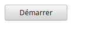
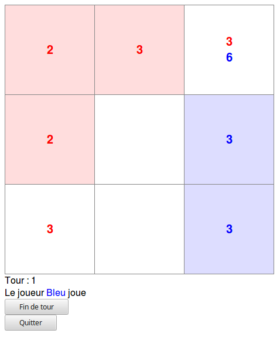
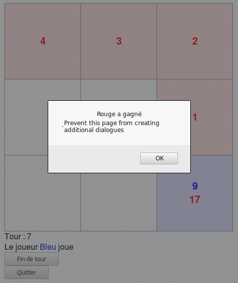

# Test Wemanity

## Jeu

### Règles

Le jeu est une sorte de Risk, la carte a la forme d'un jeu de morpion.

Il se joue au tour par tour, avec deux joueurs humains.

Lors de son tour, un joueur peut sélectionner une case de départ, puis sélectionner une case d'arrivée et entrer le nombre de soldats à envoyer.
Un joueur ne peut envoyer de soldats qu'à partir des cases qui lui appartiennent, vers des cases adjacentes. Une armée ne peut se déplacer que d'une case par tour.

Lorsqu'il a terminé ses déplacements, le joueur clique sur "Fin de tour", cela passe la main au joueur suivant. Lorsque tous les joueurs ont effectués leurs déplacements, cela termine le tour.

Lorsqu'un tour se termine, certaines cases sont gagnées par des joueurs si ils y ont déplacé leurs armées. Si un joueur abandonne une case, celle-ci redevient neutre. Si deux joueurs ont des armées sur la même case, il y a un combat, la case appartient ensuite au vainqueur, ou redevient neutre en cas d'égalité. Ensuite, 1 soldat supplémentaire est attribué au propriétaire de chaque case.

La partie se termine lorsque l'un des deux joueurs n'a plus d'armée.

### Captures d'écran

Page de démarrage :

Aperçu du jeu :

Victoire :

### Lancement

Il y a deux façon de lancer le jeu :
* Soit en ouvrant le fichier `index.html` dans un navigateur
* Soit en démarrant le serveur : `$ nodejs index.js server`, puis en se connectant sur [http://localhost:3003](http://localhost:3003)

## Développement

### Implémentation technique

L'application est uniquement en front-end, il n'y a pas vraiment de serveur. Il pourrait être utile d'en mettre un, pour par exemple éviter la triche en empêchant l'utilisateur de modifier l'état depuis Firebug, ou pour la persistance des informations de la partie.

Le serveur est en NodeJS, il sert juste au développement (compilation des fichiers JS et CSS), à lancer les tests unitaires, ou éventuellement servir les fichiers statiques. NodeJS version 6 a été utilisé pour le développement.

Les librairies utilisées pour le front-end sont :
* Le CSS est écrit en [LESS](http://lesscss.org)
* L'affichage est écrit avec [React](https://reactjs.org)

Les librairies utilisées côté serveur :
* Les fichiers sont servis avec [Express](http://expressjs.com)
* Les tests unitaires se font avec [Jasmine](https://jasmine.github.io)
* La compilation des fichiers JSX en JS est faite grâce à [Webpack](https://webpack.js.org) version 3

### Prérequis

* NodeJS et NPM doivent être installés

### Installation

Pour installer les dépendances, depuis la racine du dossier :

`$ npm install`

Pour transpiler les fichiers Javascript :

`$ nodejs ./index.js js`

Pour recompiler les fichiers Less en CSS :

`$ nodejs ./index.js css`

Pour lancer les tests unitaires :

`$ nodejs ./index.js test`

Pour démarrer le serveur web (écoute sur le port 3003) :

`$ nodejs ./index.js server`
